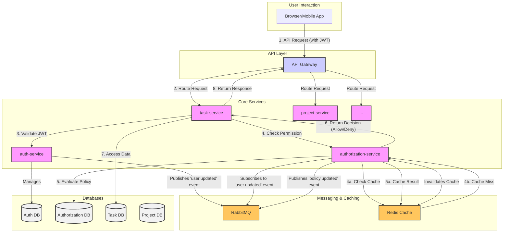
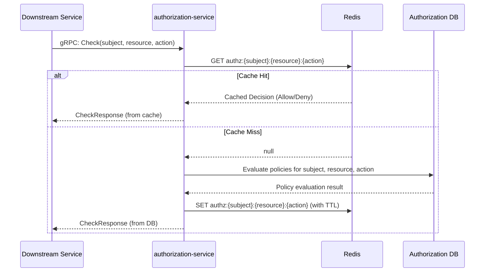
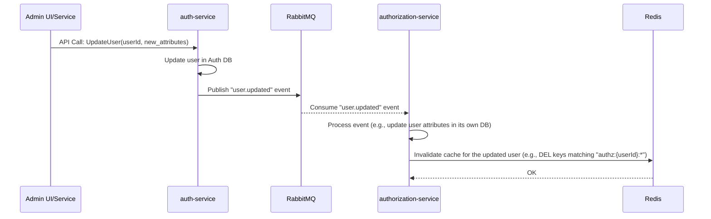

# Updated Authorization Microservice Architecture

This document outlines the enhanced architecture for the `authorization-service`, incorporating Redis for caching and RabbitMQ for asynchronous communication to improve performance and scalability.

## 1. Overall Architecture

The updated architecture introduces Redis and RabbitMQ to the existing `authorization-service` ecosystem.

*   **Redis** is added as a caching layer to reduce latency for the high-traffic `Check` API call.
*   **RabbitMQ** is integrated to decouple services and enable event-driven updates for policies, roles, and user attributes.

### 1.1. Updated Architecture Diagram



## 2. Caching Strategy (Redis)

### 2.1. Goal
To reduce the latency of the `Check` API call by caching authorization decisions.

### 2.2. Caching Strategy
The `CheckResponse` will be cached. This response contains a simple `allowed: true/false` decision.

*   **Cache Key:** A composite key will be used to ensure specificity.
    `authz:{subject}:{resource}:{action}`
    *   `subject`: The user ID.
    *   `resource`: The resource being accessed (e.g., `tasks/123`).
    *   `action`: The action being performed (e.g., `tasks:edit`).

*   **Cache TTL (Time-To-Live):** A short TTL (e.g., 5-15 minutes) is recommended to balance performance gains with data freshness. The optimal TTL will depend on how frequently permissions change.

### 2.3. Cache Invalidation
The cache will be invalidated proactively when changes occur that could affect an authorization decision.

*   **Events Triggering Invalidation:**
    *   A policy is created, updated, or deleted.
    *   A role is created, updated, or deleted.
    *   A user is assigned to or removed from a role.
    *   A user's attributes (that are used in policies) are updated.

*   **Mechanism:** When the `authorization-service` processes an event that changes permissions (e.g., from RabbitMQ), it will identify all affected subjects and delete the relevant cache keys from Redis.

### 2.4. Sequence Diagram: `Check` Request with Redis Cache



## 3. Asynchronous Communication (RabbitMQ)

### 3.1. Goal
To decouple the `authorization-service` from other services and enable an event-driven architecture for propagating changes.

### 3.2. Events Published by `authorization-service`
The `authorization-service` will publish events when changes are made to its core data. This allows other services to react to permission changes if needed.

*   **Exchange:** `authorization.events` (Topic Exchange)
*   **Routing Keys & Events:**
    *   `policy.created`, `policy.updated`, `policy.deleted`
    - `role.created`, `role.updated`, `role.deleted`
    - `role.binding.created`, `role.binding.deleted`

*   **Message Format (Example for `policy.updated`):**
    ```json
    {
      "eventId": "uuid-v4",
      "eventType": "policy.updated",
      "timestamp": "2023-10-27T10:00:00Z",
      "payload": {
        "policyId": "policy-uuid-123",
        "changes": {
          "description": "New description",
          "actions": ["tasks:create", "tasks:edit"]
        }
      }
    }
    ```

### 3.3. Events Subscribed to by `authorization-service`
The `authorization-service` will subscribe to events from other services to keep its own data and cache up-to-date.

*   **Subscribed Exchange:** `auth.events` (From `auth-service`)
*   **Queue:** `authz.user_updates.queue`
*   **Binding Key:** `user.#` (to receive all user-related events)
*   **Events of Interest:**
    *   `user.updated`: When a user's attributes (e.g., department, location) change, which might be relevant for ABAC policies.
    *   `user.deleted`: To clean up user roles and permissions.

### 3.4. Sequence Diagram: User Role Update via RabbitMQ

This diagram shows how a change in the `auth-service` propagates to the `authorization-service`.



## 4. Conclusion

By integrating Redis and RabbitMQ, the `authorization-service` becomes more performant, resilient, and scalable. Caching reduces latency for frequent authorization checks, while the event-driven approach ensures that the system remains responsive and loosely coupled.